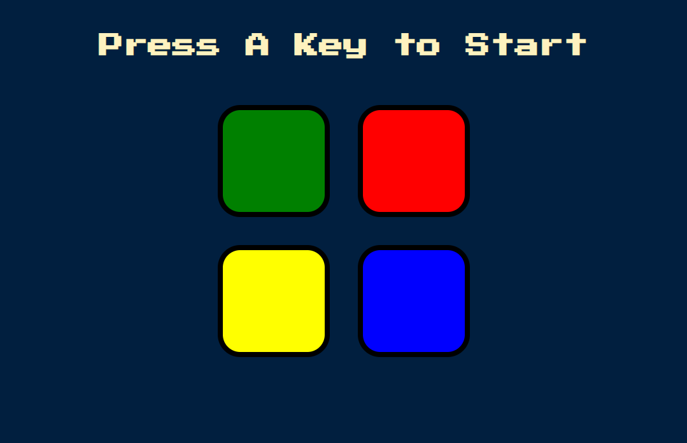

# Simon Game

A fun and interactive game that tests your memory skills! Follow the sequence of lights and sounds, and see how far you can go!

## Table of Contents

- [Demo](#demo)
- [Technologies Used](#technologies-used)
- [Features](#features)
- [Getting Started](#getting-started)
- [Installation](#installation)
- [Code Explanation](#code-explanation)
- [Contributing](#contributing)

## Demo

Try the live demo [here](https://shafayat666.github.io/web-js-simon-game/).



## Technologies Used

- HTML
- CSS
- JavaScript
- jQuery

## Features

- Interactive game that tests your memory skills.
- Randomly generated sequences of colors and sounds.
- Game over sequence and option to restart.
- Responsive design.

## Getting Started

To get a local copy of the game running on your machine, follow the steps in the [Installation](#installation) section below.

## Installation

1. Clone the repository:
   ```bash
   git clone https://github.com/shafayat666/web-js-simon-game.git
   ```
2. Open the project folder:
    ```bash
    cd web-js-simon-game
    ```
3. Open `index.html` in your web browser. 

## Code Explanation

The approach to building this game was to create a dynamic and interactive memory game where the game logic was divided into clear, manageable functions. Here’s how the problem was tackled:

1. **Setting Up Variables and Game State**:
   - The first step was to identify what information needed to be tracked throughout the game. Variables like `gamePattern`, `userClickedPattern`, `level`, and `started` were set up to manage game state. 
   - This allowed for easy resetting of the game and seamless progression from level to level.

2. **Game Start Trigger**:
   - The game begins only when the user presses any key (`$(document).keypress`). This event listener checks the `started` flag to ensure that the game doesn’t restart mid-play.
   - Once triggered, the `nextSequence()` function is called to initiate the first sequence. 

3. **Generating Random Patterns**:
   - The primary challenge was to generate and display a random sequence that users have to memorize and repeat. 
   - Each time `nextSequence()` is called, it resets the `userClickedPattern` array, increments the level, and appends a randomly chosen color to `gamePattern`. The color is then animated and played as a sound.
   - By adding one new color to the sequence each time, the game pattern progressively becomes more challenging.

4. **Handling User Input**:
   - A key design choice was to ensure that button clicks should only be registered while the game is running. This was handled by adding a condition (`started` flag) within the `.click()` event listener, so user inputs are ignored if the game hasn’t started.
   - Each button press by the user adds their chosen color to `userClickedPattern`, and `checkAnswer()` is called to compare it with the `gamePattern`. 
   - This ensures immediate feedback to the user—if their input matches the game’s sequence, they can proceed; if it doesn’t, the game signals a loss.

5. **Comparing Game Patterns**:
   - One of the critical steps was checking if the user’s input matches the game’s sequence. This was achieved through `checkAnswer(currentLevel)`, which compares the last input (`userClickedPattern[currentLevel]`) with the corresponding entry in `gamePattern`.
   - If the inputs don’t match, the game plays a "wrong" sound, displays a visual effect, and resets.

6. **Restarting the Game Smoothly**:
   - The `startOver()` function ensures that the game resets completely when the user makes a mistake. This function clears the `gamePattern`, resets the `level`, and toggles the `started` flag back to `false`.
   - A restart prompt allows the user to start fresh without refreshing the page.

7. **Modular Functions**:
   - Functions like `playSound(name)`, `animatePress(currentColor)`, and `checkAnswer(currentLevel)` were created to break down the game logic into smaller, manageable parts.
   - This modular approach made it easier to develop, debug, and enhance individual components without affecting the rest of the game.

**Approach Summary**:
The problem was tackled by breaking down the game logic into clear, modular components that handled specific parts of the game flow, from starting the game and generating random patterns to handling user inputs and providing feedback. This approach allowed for a more organized codebase, easier debugging, and a more engaging user experience. The use of conditions (`started` flag) ensured the game ran smoothly, without unintended behaviors during play or after a game-over event.

## Contributing

Contributions are welcome! Please open an issue or create a pull request if you have any improvements or bug fixes.
